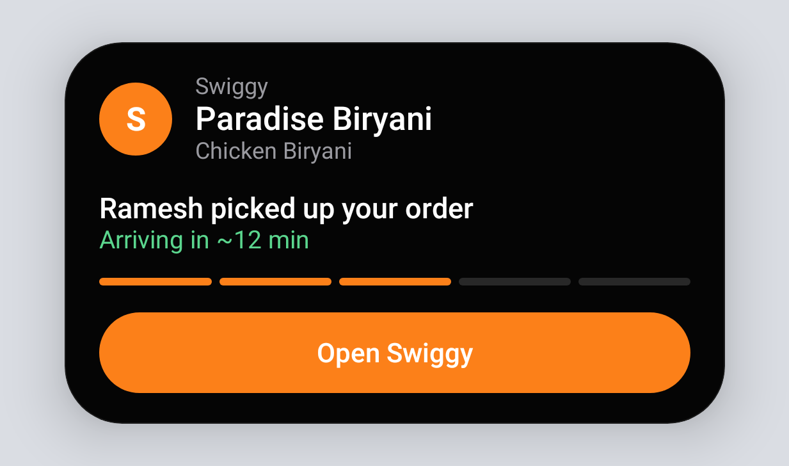
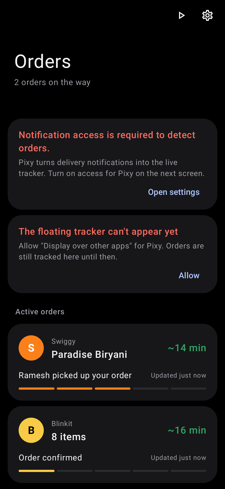

# Pixy: a floating order tracker for Samsung

A private, on-device Android app that turns delivery notifications from **Swiggy, Zomato, Blinkit, BigBasket and Instamart**
into a small Dynamic Island-style pill at the top of the screen. Built for a Galaxy S21 FE on One UI 8 (Android 16), and
works on Android 12+.

| Pill states | Light / dark |
|---|---|
|  |  |

More renders in [`docs/screenshots`](docs/screenshots) (compact, two orders, status peek, delivered, setup, home).

## Install on your phone

**Easiest (no restrictions):** with USB debugging on,
```
adb install -r Pixy-1.0.apk
```
**Or** copy `Pixy-1.0.apk` to the phone and open it. Android 13+ then treats Pixy as "sideloaded" and greys out
Notification access with *Restricted setting*. To unlock it: **Settings → Apps → Pixy → ⋮ (top right) → Allow restricted
settings**, then turn on Notification access. The setup screen walks you through this.

The APK in the release is signed with a local debug key. If you later build it yourself, uninstall this copy first
(different signature).

## First launch

1. **Notification access** (required): Pixy reads notifications from the apps above. Other apps' notifications are dropped
   before their text is read; chat messages are excluded from the listener entirely (`disabled_filter_types=conversations`).
2. **Display over other apps** (for the pill).
3. **Battery → Unrestricted** (recommended on Samsung, so One UI never puts Pixy to sleep).
4. **Order notifications** (optional, off): asks for the notification permission only when you turn it on.

Then open **Test mode** (▶ on the home screen) and tap *Play a Swiggy order* or *Two orders at once* to see the pill.

## Using it

- Pill appears only while an order is active; it hides completely otherwise.
- **Tap** to expand. **Tap an order** to open the delivery app (its own tracking deep link when available).
- **Long-press** to open the order in Pixy. **Swipe up** to hide it until the next update (the order is kept).
- New order: pill peeks wider with the status, then settles. Status change: content slides, pill pulses.
  Delivered: green check for ~4 s, then it disappears (setting).
- Multiple orders: the most recently updated / closest-to-the-door order leads; others show as small icons and as rows
  when expanded.

## How it works

```
NotificationListenerService ─► NotificationParser ─► OrderManager ─► Room ─► OverlayController (pill)
   (package filter first)        (adapter per app)     (state machine)            └► TrackerNotifier (optional)
```

| Folder | What's there |
|---|---|
| `notifications/` | `OrderListenerService`, `SnapshotExtractor` (standard notification fields only), `TrackerNotifier` |
| `parsers/` | `DeliveryAppAdapter`, `RuleBasedAdapter`, `SwiggyAdapter`, `ZomatoAdapter`, `BlinkitAdapter`, `BigBasketAdapter`, `InstamartAdapter`, `GenericDeliveryAdapter`, `EtaParser`, `TextNormalizer`, `StatusRules`, `AdapterRegistry` |
| `domain/` | `OrderManager` (state machine), `OrderEngine` (wiring), `Simulator` (test mode) |
| `models/` | `Order`, `OrderStatus`, `NotificationSnapshot`, `ParseResult`, `SourceApp` |
| `data/` | Room entity, DAO, database, repository |
| `overlay/` | `OverlayController`, Compose pill (`IslandPill.kt`), cutout-aware `PillPositioner` |
| `ui/` | Setup, Orders, Order detail, Settings, Add app, Debug, Test mode |
| `settings/`, `utils/` | DataStore settings, permissions, launcher, formatters, in-memory debug log |

**Statuses:** `UNKNOWN, CONFIRMED, PREPARING, READY, PICKED_UP, OUT_FOR_DELIVERY, ARRIVING, DELIVERED, CANCELLED, FAILED`.
Status only moves forward (a late "preparing" can't undo "picked up"); cancelled/failed/delivered end an order from any
state. Promotions ("50% off… order now") never create orders, and nothing is created from a final status alone.

**ETA:** taken only from the notification ("in 18 mins", "10–15 min", "1 hr 5 min", "at 11:25 PM", "between 7–9 PM").
It counts down locally between notifications. If the app gave none, or it has passed, Pixy shows the status
("Order in progress") instead of inventing a time.

**Adding a service:** write a small class extending `RuleBasedAdapter` (package name, extra status phrases, ignore/promo
rules, merchant patterns) and add it to `AdapterRegistry.defaultAdapters()`. Without code: Settings → Supported apps →
*Add another app* uses the generic parser for any installed app.

## Privacy

No INTERNET permission, no accounts, analytics, ads or servers. Room stores only parsed fields (app, store, status, ETA,
rider first name, times), never notification text. Backups and device transfer are excluded. The Debug screen's raw text
lives in memory only and is off by default in release builds; release builds also strip all `Log` calls.
Settings → Privacy → *Clear stored orders*; Home → Recent orders → *Clear*.

## Honest limitations

- **Not yet run on a real phone.** This was built in a cloud container without an Android emulator (no KVM). It is
  verified by a clean build, Android Lint (0 issues), 82 JVM/Robolectric tests on the Android 16 framework
  (parsers, ETA, state machine, Room, notification extraction, the full notification → pill pipeline, pill interactions)
  and rendered screenshots. Real-device checks still to do on the S21 FE: the exact wording each app uses today
  (use **Debug → Recent notifications**), the pill position on your screen, and Samsung's battery behaviour.
- **The pill sits below the status bar, not over it.** Android draws `TYPE_APPLICATION_OVERLAY` windows under the status
  bar and keyboard, and there is no supported API to draw a third-party window over system UI. Default placement is
  just under the status bar, centred under the camera. *Around the camera* is available in Settings but the status bar
  may intercept taps there.
- **Wording varies and changes.** Parsing is rule-based and offline. If an app rewords a notification, the Debug screen
  shows the raw text and why it was (not) matched, and *Try wording* lets you test a phrase before changing a rule.
- **Custom notification layouts.** Apps that draw notifications with custom views expose little text through the
  standard fields; Android offers no supported way to read those views. They show up in Debug as "no readable text".
- **Deep links are memory-only.** The delivery app's own "open tracking" link can't be persisted; after Pixy restarts,
  tapping opens the app's home screen instead.
- **Instamart inside the Swiggy app** is detected by the word "Instamart"; if Swiggy omits it, the order shows as Swiggy.
- **Live Update notifications** (optional setting): Android promotes them to status-bar chips from Android 16 QPR2
  (API 36.1); on earlier builds they are normal quiet notifications. Whether One UI shows third-party Live Updates in
  the Now Bar is Samsung's choice.
- Orders that go silent are closed automatically after 3 hours without updates (or 90 min past their ETA).
- The pill is near-black in both light and dark mode on purpose, so it blends with the camera hole.

## Build

JDK 17+, Android SDK 37.2. AGP 9.4.1, Gradle 9.8 (wrapper), Kotlin 2.4.20, Compose BOM 2026.09.00, Room 2.8.5.
Open in a recent Android Studio that supports AGP 9.4, or from the command line:

```
./gradlew :app:testDebugUnitTest :app:lintDebug :app:assembleRelease
# APK: app/build/outputs/apk/release/app-release.apk
```

Debug builds install as `com.pixy.ordertracker.debug` (side by side with release) and have the parser log on by default.
Put a `keystore.properties` (storeFile, storePassword, keyAlias, keyPassword) in the project root to sign release
builds with your own key.
